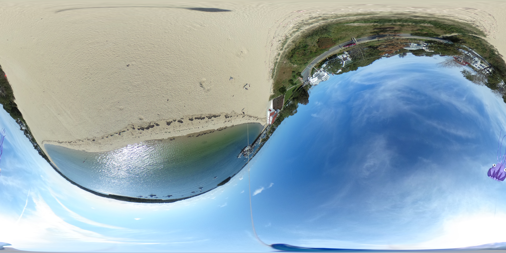

Straightening out the horizon in 4pi-steradian Kite Aerial Photos

The python code [dm4.py](dm4.py) attempts to straighten out wavy horizon in 4pi-steradian Kite Aerial Photos, based on user input. E.g., an equirectangular 
input image from the 360-degree (4pi-steradian really) camera hanging upside-down from the kite line is shown below. The wavy horizon, because the 
camera is freely hanging, is evident.

Once this image is run through the code dm4.py, the output is shown below:

The code uses the pyEquirectRotate library from 
https://github.com/BlueHorn07/pyEquirectRotate. However Wheaton CS seniors 
during Spring 2023 semester made some speedup improvements by replacing a 
few nested for-loops by numpy vectorizations. See the top of the code 
equirectRotate/EquirectRotate.py for details.

Requirements:
- Matplotlib
- numpy
- opencv-python
